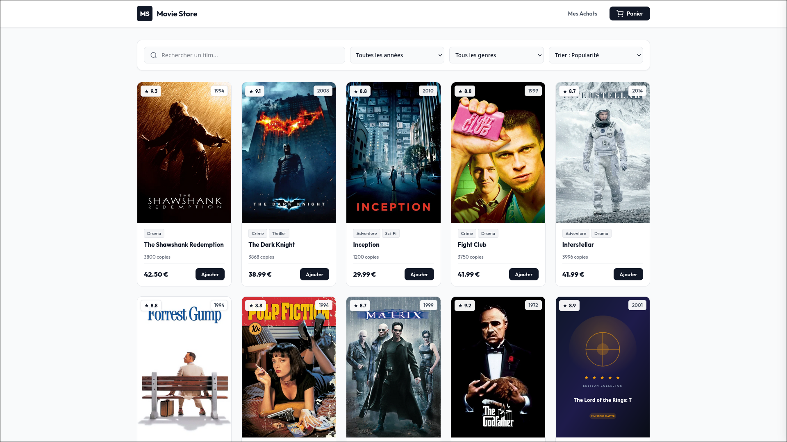
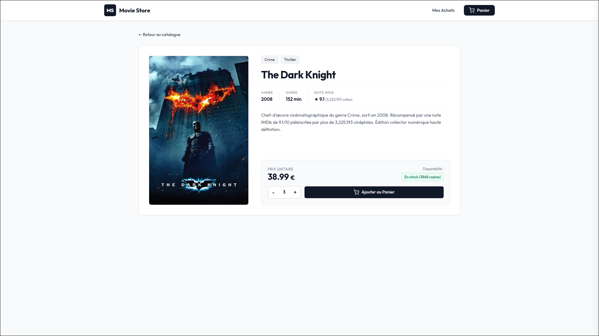
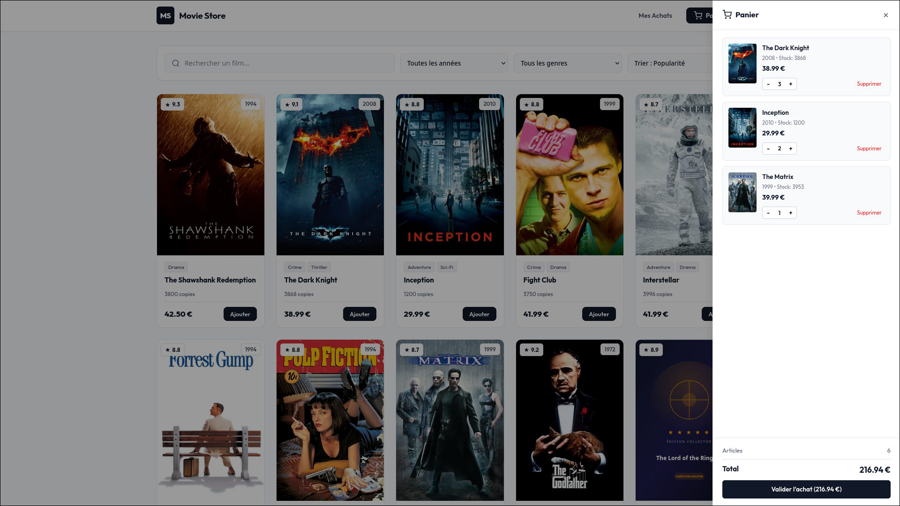
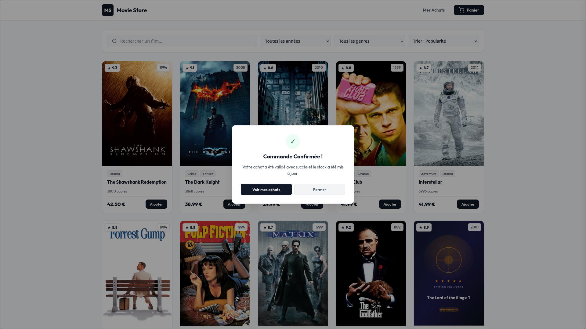
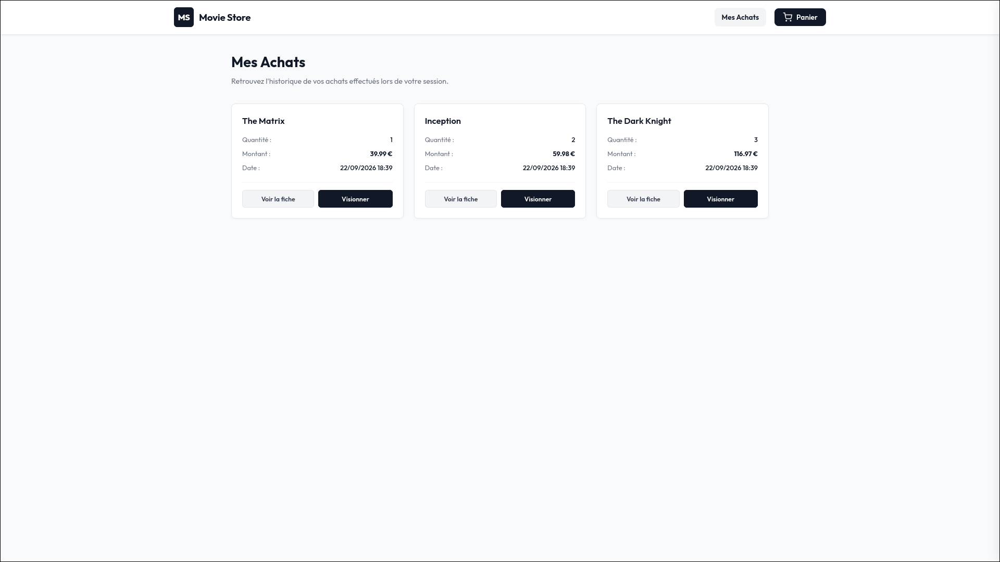
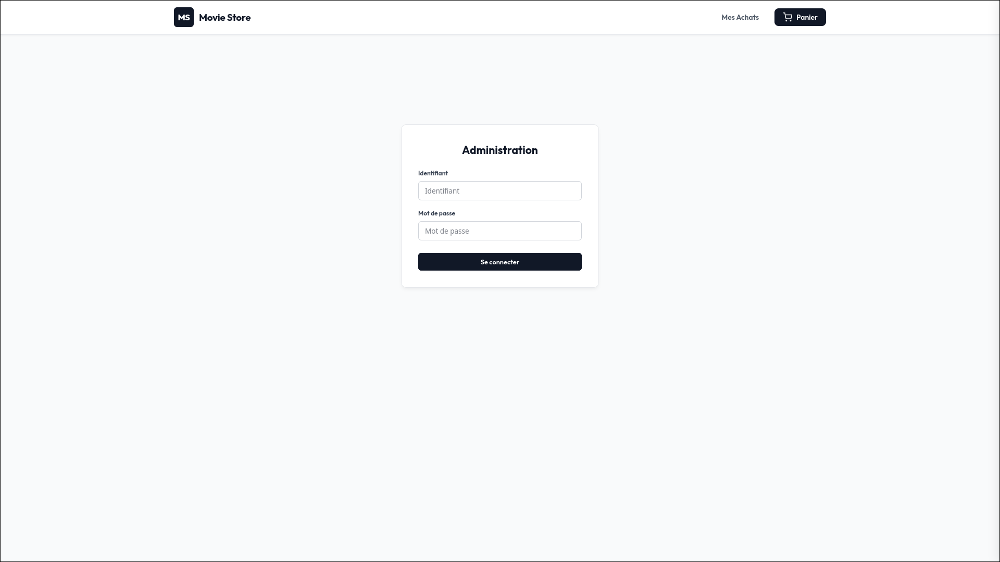
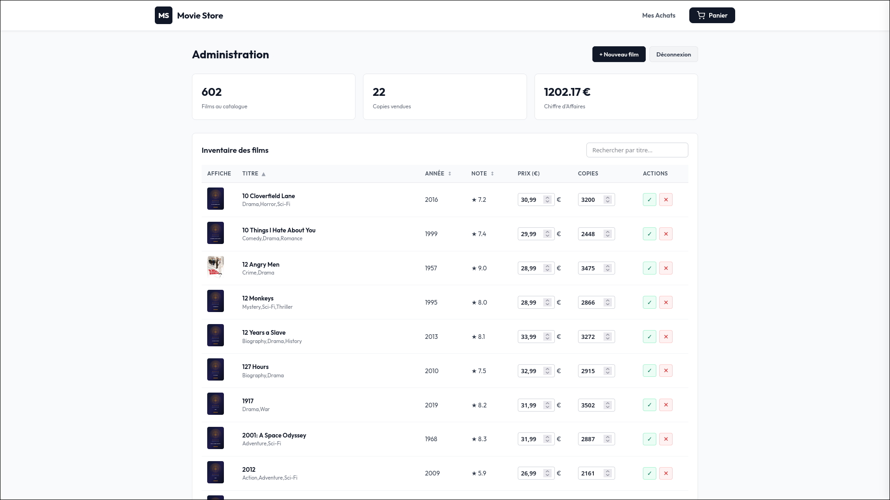

# Movie Store

## Lancement du Projet

### Backend (Spring Boot)

```bash
cd backend
mvn spring-boot:run
```

Le serveur backend démarre sur `http://localhost:8080`.

### Frontend (Angular)

```bash
cd frontend
npm start
```

L'application est accessible sur `http://localhost:4200`.

---

## Pages du Site

### Page d'Accueil



### Détail d'un Film



### Panier



### Validation de la Commande



### Mes Achats



### Connexion Administrateur



### Panneau d'Administration


